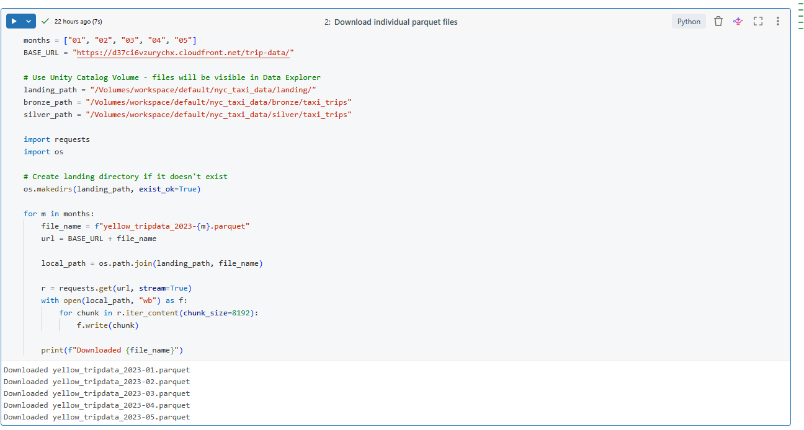
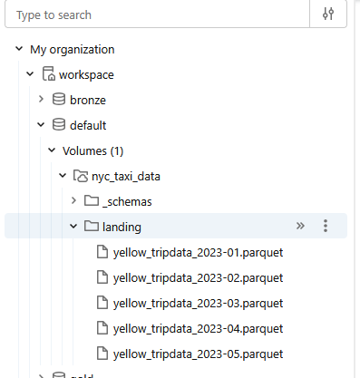
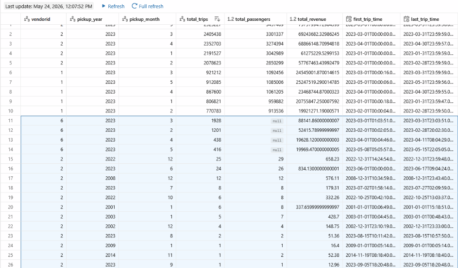
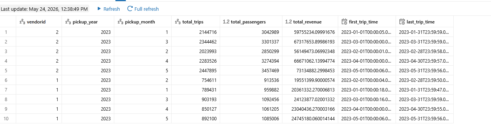
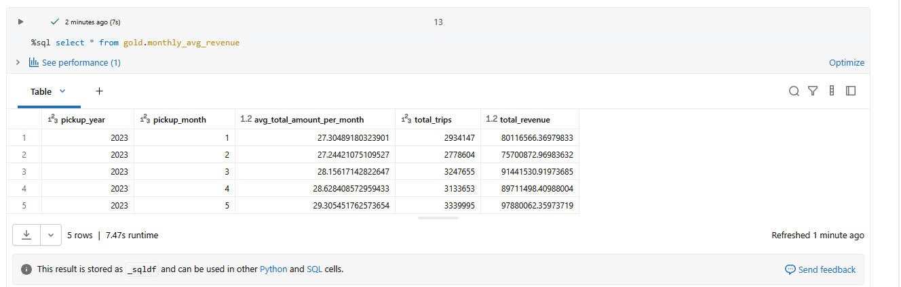
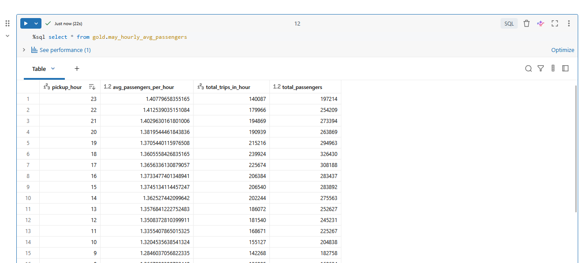
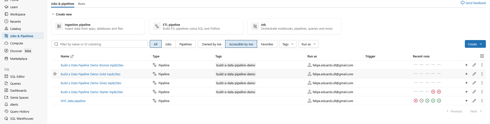
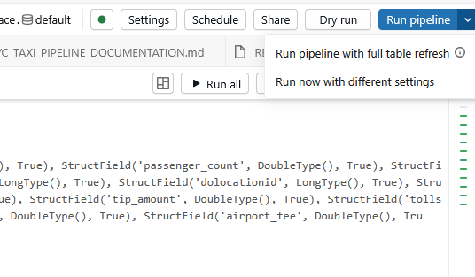

# ifood-case
Repositório contêm pipeline de dados e análises referentes ao case

# NYC yellow taxi pipeline

Pipeline de dados para análise de viagens de táxi amarelo de NYC (Janeiro-Maio 2023) usando Databricks Lakeflow Spark Declarative Pipelines (Similar em estrutura a um projeto DBT).


---

## Índice

- [Visão Geral](#-visão-geral)
- [Arquitetura](#-arquitetura)
- [Fonte de Dados](#-fonte-de-dados)
- [Camadas do Pipeline](#-camadas-do-pipeline)
  - [Bronze](#bronze-ingestão-bruta)
  - [Silver](#silver-limpeza-e-validação)
  - [Gold](#gold-agregações-de-negócio)
- [Métricas do Pipeline](#-métricas-do-pipeline)
- [Configuração](#%EF%B8%8F-configuração)
- [Como Executar](#-como-executar)
- [Próximos Passos](#-próximos-passos)

---

## 🎯 Visão geral

Este pipeline processa dados históricos de viagens de táxi amarelo de NYC através de uma arquitetura medalhão (Bronze → Silver → Gold), carregando e transformando dados de janeiro a maio de 2023.

### Extração dos dados

Através do notebook 

```
src\explorations\landing_layer_and_setup.py
```

foi feita a extração dos dados de vianges [NYC Taxi Trips](https://www.nyc.gov/site/tlc/about/tlc-trip-record-data.page) e mantida numa camada de ***landing*** com os dados brutos.

Resultado da extração



Camada ***landing***



---

## Arquitetura medalhão

```
📂 Camada landing (Parquet Files)
    ↓
🥉 Bronze Layer (16,2M registros)
    ↓ Filtros de qualidade (95,4%)
🥈 Silver Layer (15,4M registros)
    ↓ Agregações analíticas
🥇 Gold Layer (10 registros + 2 views)
```

### Estrutura do catálogo

 Camada | Catálogo | Schema
--------|----------|--------
 Bronze | `workspace` | `bronze`
 Silver | `workspace` | `silver`
 Gold | `workspace` | `gold`

---

## 📊 Fonte de dados

### Arquivos
 Arquivo | Registros | Período |
---------|-----------|---------|
 `yellow_tripdata_2023-01.parquet` | 2.952.673 | Janeiro 2023 |
 `yellow_tripdata_2023-02.parquet` | 2.741.024 | Fevereiro 2023 |
 `yellow_tripdata_2023-03.parquet` | 3.430.688 | Março 2023 |
 `yellow_tripdata_2023-04.parquet` | 3.555.366 | Abril 2023 |
 `yellow_tripdata_2023-05.parquet` | 3.506.635 | Maio 2023 |
 **TOTAL** | **16.186.386** | **Jan-Mai 2023** |

### ⚠️ Inconsistências de schema descobertas

### Durante a análise dos arquivos, foram vistos alguns pontos que tiveram que ser tratados como:
- colunas nulas
- datas inconsistentes nos arquivos (os arquivos deveriam conter os dados de cada mês, mas continham também datas furturas como por exemplo o ano de 2024)



esses dados foram excluídos dos resultados, visto que lógicas de negócio utilizavam o ***VendoId*** e outros campos nas métricas e sendo assim, não faziam sentido estarem nos dados disponibilizados na camada analítica

- conflito de tipos nos dados (colunas possuiam tipos diferentes para o mesmo campo)
 Coluna | Janeiro | Fev-Mai | Problema |
--------|---------|---------|----------|
 `VendorID` | `long` | `int` | Conflito de tipo |
 `passenger_count` | `double` | `long` | Conflito de tipo |
 `RatecodeID` | `double` | `long` | Conflito de tipo |
 `PULocationID` | `long` | `int` | Conflito de tipo |
 `DOLocationID` | `long` | `int` | Conflito de tipo |
 `Airport_fee` | `double` | `long` | Conflito de tipo |

- normalização de nomes de campos para lowercase, visto que parquets tinham diferenças

---

## Camadas do pipeline

### Bronze: Ingestão bruta

**Arquivo**: `transformations/bronze.py`  
**Tabela final**: `workspace.bronze.bronze_yellow_taxi`  

#### Implementação

Leitura individual de cada arquivo com **conversão explícita de tipos ANTES** da normalização de nomes de colunas:

```python
for file in files:
    df = spark.read.format("parquet").load(f"{landing_path}{file}")
    
    # Cast all columns to consistent types BEFORE renaming
    df = df.withColumn("VendorID", col("VendorID").cast(LongType()))
    df = df.withColumn("passenger_count", col("passenger_count").cast(DoubleType()))
    df = df.withColumn("RatecodeID", col("RatecodeID").cast(DoubleType()))
    df = df.withColumn("PULocationID", col("PULocationID").cast(LongType()))
    df = df.withColumn("DOLocationID", col("DOLocationID").cast(LongType()))
    df = df.withColumn("Airport_fee", col("Airport_fee").cast(DoubleType()))
    
    # Normalize column names to lowercase
    for column_name in df.columns:
        df = df.withColumnRenamed(column_name, column_name.lower())
    
    # Add metadata columns
    df = df.withColumn("ingestion_timestamp", current_timestamp())
    df = df.withColumn("source_file", lit(f"{landing_path}{file}"))
    
    dfs.append(df)
```

#### Colunas de metadados adicionadas
- `ingestion_timestamp` - timestamp da ingestão
- `source_file` - nome do arquivo de origem

#### Resultados
- ✅ **16.186.386 registros** (100% carregados)
- ✅ **0% NULL** em `vendorid`
- ✅ **2,65% NULL** em `passenger_count` (NULLs legítimos da fonte)

---

### Silver: Limpeza

**Arquivo**: `transformations/silver.py`  
**Tabela final**: `workspace.silver.silver_yellow_taxi`  

#### Filtros de qualidade aplicados

1. ✅ `trip_distance > 0` - Distância de viagem válida
2. ✅ `fare_amount > 0` - Valor da tarifa válido
3. ✅ `total_amount > 0` - Valor total válido
4. ✅ `passenger_count IS NOT NULL` - Contagem de passageiros presente
5. ✅ `pickup_year == 2023` - Remove datas anômalas (2001, 2008, 2022)
6. ✅ `pickup_month BETWEEN 1 AND 5` - Apenas Jan-Mai

#### Colunas derivadas
- `pickup_year` - Ano extraído de `tpep_pickup_datetime`
- `pickup_month` - Mês extraído de `tpep_pickup_datetime`

#### Resultados
- ✅ **15.434.054 registros** (95,4% da camada bronze)
- ✅ Melhoria significativa após correção do casting de tipos

#### Propriedades da tabela
```python
table_properties={
    "delta.enableChangeDataFeed": "true", # colocado para caso haja ingestão incremental, obter apenas a diferença
    "delta.feature.timestampNtz": "supported",
    "quality": "silver"
}
```

---

### Gold: Métricas de negócio

#### 1. Agregação de viagens (`workspace.gold.gold_yellow_taxi`)

**Arquivo**: `transformations/gold.py`  

**Agrupamento**: Por `vendorid`, `pickup_year`, `pickup_month`

**Métricas Calculadas**:
- `total_trips` - Total de viagens
- `total_passengers` - Total de passageiros
- `total_revenue` - Receita total
- `avg_trip_distance` - Distância média por viagem
- `avg_fare` - Tarifa média
- `first_trip_time` - Horário da primeira viagem
- `last_trip_time` - Horário da última viagem

**Resultado**: 10 registros (2 vendors × 5 meses)



#### 2. Receita média mensal (`workspace.gold.monthly_avg_revenue`)

**Arquivo**: `transformations/gold_may_hourly_avg_passengers.sql`  
**Tipo**: SQL View

Usa a tabela da camada silver para criar a visão já calculada na camada gold por mês em todos os táxis.

```sql
SELECT 
    pickup_year,
    pickup_month,
    AVG(total_amount) as avg_total_amount_per_month,
    COUNT(*) as total_trips,
    SUM(total_amount) as total_revenue
FROM workspace.silver.silver_yellow_taxi
GROUP BY pickup_year, pickup_month
ORDER BY pickup_year, pickup_month;
```

Resultando na visualização


#### 3. Passageiros por hora em maio (`workspace.gold.may_hourly_avg_passengers`)

**Arquivo**: `transformations/gold_monthly_avg_revenue.sql`  
**Tipo**: SQL View

Calcula a média de `passenger_count` por hora do dia em Maio de 2023.

```sql
SELECT 
    HOUR(tpep_pickup_datetime) as pickup_hour,
    AVG(passenger_count) as avg_passengers_per_hour,
    COUNT(*) as total_trips_in_hour,
    SUM(passenger_count) as total_passengers
FROM workspace.silver.silver_yellow_taxi
WHERE pickup_month = 5
GROUP BY HOUR(tpep_pickup_datetime)
ORDER BY pickup_hour;
```

Resultando na visualização


---

## ⚙️ Configuração

### Arquivos

```
transformations/
├── bronze.py                               # Camada Bronze
├── silver.py                               # Camada Silver
├── gold.py                                 # Agregações Gold
├── gold_may_hourly_avg_passengers.sql      # View contendo a análise de Maio/23
└── gold_monthly_avg_revenue.sql            # View contendo a análise de vendors total por mês e receita média
```

---

## 🚀 Como executar


### Executar o notebook disponível em ***src/explorations/landing_layer_and_setup.py*** que irá

#### 1. Criar schemas

```python
spark.sql("CREATE SCHEMA IF NOT EXISTS workspace.bronze")
spark.sql("CREATE SCHEMA IF NOT EXISTS workspace.silver")
spark.sql("CREATE SCHEMA IF NOT EXISTS workspace.gold")
```

#### 2. Baixar os arquivos para a área de landing


#### 3. Executar o pipeline

**Via Interface**:
- Importar o pipeline transformations na seção de "ETL pipelines" do Databricks


- Clique no botão "Start" no editor de pipeline


#### 3. Verificar resultados

```python
# Verificar Bronze
spark.table("workspace.bronze.bronze_yellow_taxi").display()

# Verificar Silver
spark.table("workspace.silver.silver_yellow_taxi").display()

# Verificar Gold
spark.table("workspace.gold.gold_yellow_taxi").display()
spark.table("workspace.gold.monthly_avg_revenue").display()
spark.table("workspace.gold.may_hourly_avg_passengers").display()
```

---

## 🎯 Próximos passos e melhorias

### 1. Configurar ingestão incremental (Futuro)

Quando novos meses de dados chegarem:
- Adicionar novos caminhos de arquivo ao `bronze.py`
- Considerar migração para Auto Loader uma vez que schema esteja estável
- Ou continuar abordagem batch se arquivos chegarem mensalmente

### 2. Adicionar mais checks de qualidade

Expectations potenciais para adicionar:
```python
@dp.expect("valid_fare", "fare_amount < 1000")  # Detecção de outliers
@dp.expect("valid_distance", "trip_distance < 500")  # Detecção de outliers
@dp.expect("valid_passengers", "passenger_count <= 6")  # Capacidade máxima de táxi
@dp.expect("amount_logic", "total_amount >= fare_amount")  # Lógica de negócio
```

### 3. Otimização de performance

Performance atual é boa, mas para escala:
- Considerar particionamento por `pickup_month` em silver/gold
- Adicionar Z-ordering em colunas de filtro comuns

### 4. Adicionar mais métricas na camada gold (tabelas / views)

Views potenciais:
- Padrões de viagem por hora e dia da semana
- Receita por zona de pickup/dropoff
- Percentual médio de gorjeta por tipo de pagamento
- Análise de horários de pico e precificação

### 5. Monitoramento e alertas

- Configurar alertas de falha de execução do pipeline
- Monitorar contagens de registros (esperar ~3M por mês)
- Alertar sobre degradação significativa de qualidade de dados
- Dashboard de monitoramento com métricas chave

---

## 📁 Estrutura do projeto

```
NYC Fare pipeline/
├── README.md                          # Este arquivo
│
├── transformations/
│   ├── bronze.py                               # Camada Bronze (16,2M registros)
│   ├── silver.py                               # Camada Silver (15,4M registros)
│   ├── gold.py                                 # Agregações Gold (10 registros)
│   ├── gold_may_hourly_avg_passengers.sql      # Views analíticas SQL
│   └── gold_monthly_avg_revenue.sql            # Views analíticas SQL
│
└── explorations/                      # Notebooks de análise ad-hoc
    ├── landing_layer_and_setup.py     # Notebook com download de arquivos para landing e criação de schemas
    └── observations.py                # Notebook com as análises criadas e consultas
```